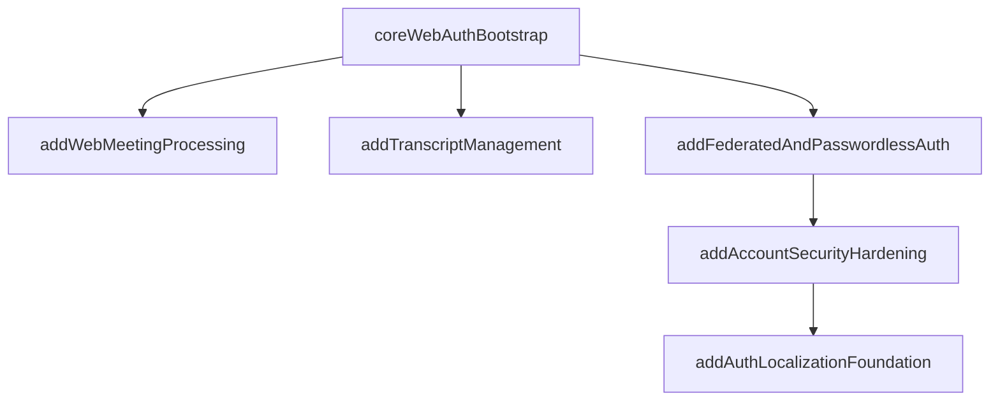

# Split `bootstrap-meeting-recap-web-platform`

## Recommendation

Keep the current change, but shrink it to the smallest platform/auth slice that unblocks later work: runtime foundation plus core email/password auth. Move processing-coupled work out, then split the remaining auth surface into separate follow-up changes.

## Why This Split Works

- The current change mixes three different scopes: platform runtime, minimum auth needed by every later feature, and optional/extended auth UX.
- `add-web-meeting-processing` only needs a verified authenticated user plus runtime/db/queue foundations. It does not need Google, One Tap, passkeys, 2FA, or localization to start.
- The current bootstrap duplicates work already specified more concretely in [openspec/changes/add-web-meeting-processing/design.md](openspec/changes/add-web-meeting-processing/design.md) and [openspec/changes/add-web-meeting-processing/tasks.md](openspec/changes/add-web-meeting-processing/tasks.md), especially around S3-backed transient storage and shared pipeline reuse.

## Proposed Reshape

### 1. Snapshot the current bootstrap change before editing

Before splitting anything, preserve a full copy of [openspec/changes/bootstrap-meeting-recap-web-platform/proposal.md](openspec/changes/bootstrap-meeting-recap-web-platform/proposal.md), [design.md](openspec/changes/bootstrap-meeting-recap-web-platform/design.md), [tasks.md](openspec/changes/bootstrap-meeting-recap-web-platform/tasks.md), and [specs/account-authentication/spec.md](openspec/changes/bootstrap-meeting-recap-web-platform/specs/account-authentication/spec.md) as a frozen reference set.

Use that preserved copy for two checks:

- during the split, to ensure every requirement, design decision, and task is intentionally re-homed
- at the end, to reconcile the original scope against the resulting set of changes and confirm that nothing was dropped silently

The end state should be a one-to-one accounting exercise: every meaningful item in the preserved bootstrap copy must map to exactly one of these outcomes:

- stays in the reduced bootstrap
- moves to a specific follow-up change
- moves into [openspec/changes/add-web-meeting-processing/design.md](openspec/changes/add-web-meeting-processing/design.md) and its companion artifacts
- is explicitly removed as scope with a written rationale

### 2. Shrink the existing bootstrap to `core web auth bootstrap`

Use [openspec/changes/bootstrap-meeting-recap-web-platform/proposal.md](openspec/changes/bootstrap-meeting-recap-web-platform/proposal.md), [design.md](openspec/changes/bootstrap-meeting-recap-web-platform/design.md), [tasks.md](openspec/changes/bootstrap-meeting-recap-web-platform/tasks.md), and [specs/account-authentication/spec.md](openspec/changes/bootstrap-meeting-recap-web-platform/specs/account-authentication/spec.md) as the source, but cut them down to only this scope:

- Next.js web runtime plus worker entrypoint
- Drizzle/Postgres, BullMQ/Redis, and Pino baseline wiring
- Better Auth base integration
- secure-cookie sessions and CSRF discipline
- account model with one-account-per-email rules
- email/password sign-up, sign-in, sign-out
- email verification
- password reset
- protected-route enforcement
- auth UI/test harness foundations such as React Hook Form, Zod, Vitest, and Playwright for these core flows

Keep from the current task list:

- `1.1`
- database/Redis parts of `1.2`
- `1.3`
- verification/reset-relevant parts of `1.4`
- `1.5`
- `3.1`
- `3.2`
- `4.1`
- `4.2`
- `4.3`
- core-auth pieces of `5.1`, `5.3`, and `5.4`

### 3. Create `add-federated-and-passwordless-auth`

Move the optional primary sign-in methods into their own change:

- Google OAuth
- Google One Tap
- magic-link sign-in
- passkey enrollment and passkey sign-in
- last-login-method UX hints
- existing-account linking and verified-email activation rules

Pull from the current bootstrap artifacts:

- task `4.4`
- task `4.5`
- task `4.6`
- matching UI/test work from `5.1` and `5.4`
- the matching requirements in [openspec/changes/bootstrap-meeting-recap-web-platform/specs/account-authentication/spec.md](openspec/changes/bootstrap-meeting-recap-web-platform/specs/account-authentication/spec.md)

### 4. Create `add-account-security-hardening`

Move security overlays and destructive account lifecycle into a separate change:

- optional 2FA
- backup codes
- trusted devices
- recent-auth enforcement
- permanent account deletion

Pull from the current bootstrap artifacts:

- task `3.3`
- task `4.7`
- matching destructive-action UI/tests from `5.1` and `5.4`
- the 2FA and account-deletion requirements in [openspec/changes/bootstrap-meeting-recap-web-platform/specs/account-authentication/spec.md](openspec/changes/bootstrap-meeting-recap-web-platform/specs/account-authentication/spec.md)

### 5. Create `add-auth-localization-foundation`

Make localization its own small follow-up change:

- locale detection and selection
- shared translation loading for auth surfaces and app chrome
- Better Auth i18n integration
- English fallback behavior

Pull from the current bootstrap artifacts:

- task `5.2`
- the localization requirements in [openspec/changes/bootstrap-meeting-recap-web-platform/specs/account-authentication/spec.md](openspec/changes/bootstrap-meeting-recap-web-platform/specs/account-authentication/spec.md)

### 6. Re-home processing-coupled work into `add-web-meeting-processing`

Remove these items from bootstrap and let [openspec/changes/add-web-meeting-processing/proposal.md](openspec/changes/add-web-meeting-processing/proposal.md), [design.md](openspec/changes/add-web-meeting-processing/design.md), and [tasks.md](openspec/changes/add-web-meeting-processing/tasks.md) own them:

- concrete S3-compatible transient blob-storage implementation
- MinIO local/CI behavior and bucket bootstrap
- browser-upload CORS details
- presigned upload flow details
- shared `libs/audio-recap` pipeline refactor
- worker-facing media I/O adapter boundaries

Move out of bootstrap:

- task group `2.x`
- the S3/object-storage portion of task `1.2`
- any design text whose only real consumer is upload/processing rather than auth/runtime foundation

## Capability Strategy

I recommend splitting the current monolithic `account-authentication` delta into smaller capability specs rather than spreading one huge capability across many changes. Suggested capabilities:

- `core-account-authentication`
- `federated-and-passwordless-auth`
- `account-security-hardening`
- `auth-localization`

This is the safer choice for agent context because each change can load a much smaller spec surface.

## Dependency Order

## Practical Outcome

After this split, the blocking foundation becomes much smaller and more implementable. The first downstream product changes can start after `coreWebAuthBootstrap`, while Google/magic-link/passkey/2FA/localization work no longer holds up processing and transcript-management delivery.

The preserved bootstrap copy becomes the final audit artifact: if a requirement, design decision, or task from the original change cannot be mapped at the end, the split is not complete.
